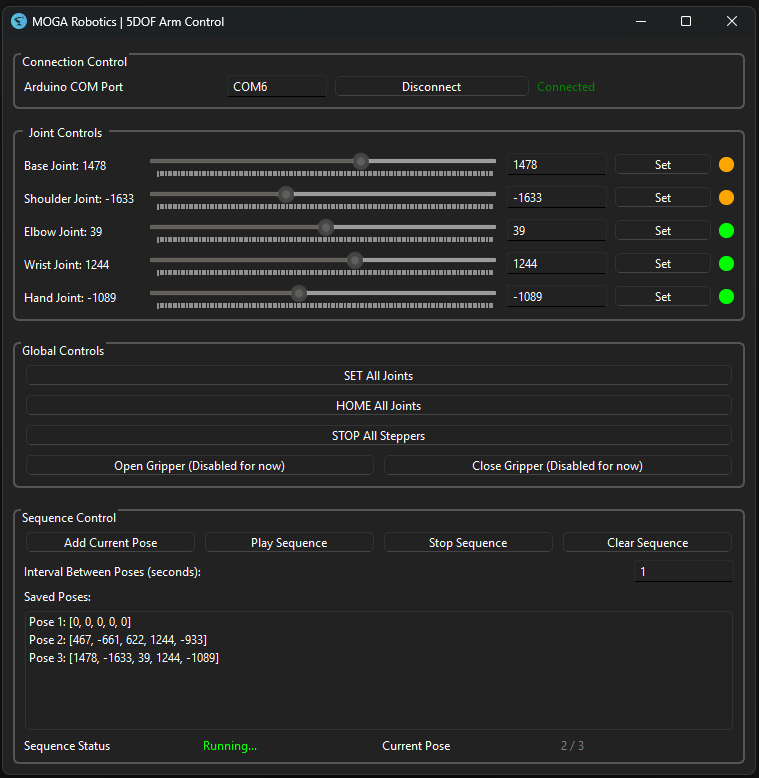

# Robotic Arm Control Interface



This application provides a graphical user interface (GUI) for controlling a robotic arm. It allows users to manipulate the joints of the arm, including the base, shoulder, and elbow, using sliders and buttons. The interface communicates with the robotic arm via a serial connection, sending commands to move the joints and control the gripper. 

Current features include:
- Adjustable sliders for each joint to set their positions.
- Input fields for precise joint value entry.
- Buttons to open and close the gripper.
- A sequence manager to play back a sequence of poses.
- A connection section to connect to the serial port of the Arduino.

Upcoming features:
- Toggle switch button for unit selection (motor steps or angles).


### How to run the application:

```
cd robotic-arm-control-app
python robotic_arm_control_gui.py
```
